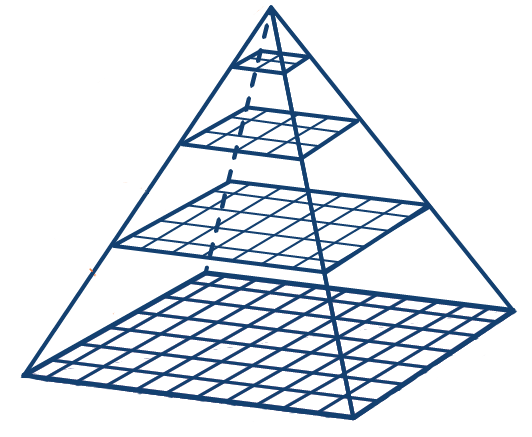

# Overview 

This is an experiment - in order to evaluate the feasibility of using [SQLite](https://www.sqlite.org/index.html) as the persistence-layer (or file-format) for multi-dimensional images (as encountered e.g. in microscopy, cf. [OME-TIFF](https://docs.openmicroscopy.org/ome-model/6.0.0/ome-tiff/index.html) or [BioFormats](https://www.openmicroscopy.org/bio-formats/)).

## Design considerations

The images we are dealing with are organized as large mosaics with a pyramid.


For a viewer capable of fast zooming and panning, it is important to quickly retrieve the tiles intersecting with the specific viewport. For this task the [R*Tree module](https://sqlite.org/rtree.html) of SQLite seems well suited and is employed.

The bitmap data itself is being stored inside the SQLite-database (as a [BLOB](https://www.sqlite.org/datatype3.html)). This is a very controversial approach, and there is a lot of discussion what the best architecture for dealing with large blobs in databases is (e.g. [here](https://dba.stackexchange.com/questions/2445/should-binary-files-be-stored-in-the-database), [here](https://www.sqlite.org/intern-v-extern-blob.html)). So, getting some real-world experience here is one goal of this experiment.

The same techniques (ie. image pyramids and tiling) are applied to 3D-volumetric data.

This library focuses solely on the storage aspect; image processing aspects are out-of-scope and they are expected to be implemented on another layer.

## data model

Currently, two data models are implemented and available via the interfaces `IDbRead`/`IDbRead3D` (and `IDbWrite`/`IDbWrite3D`)
* for multi-dimensional, tiled 2D-images with pyramid
* and for multi-dimensional, tiled 3D-images (refered to as **bricks** hereafter) with pyramid

In both cases, the tiles/bricks are paraxial.

A tile/brick is described by

field              |       description
-------------------|------------------
logical position   | coordinates and width/height of the tile
tile coordinate    | an arbitrary sized attribute

The **tile coordinate** are attributes with a specific number of dimensions, allowing to group the tiles.

All tiles are positioned in X-Y-direction in a common cartesian coordinate system. In case of bricks the **logical position** includes a Z-coordinate and a depth.


## Q & A

**Why should image data be stored in a database? What is wrong with traditional file-formats like TIFF?**

Some of the advantages expected from using RDBMS (and SQLite in particular) are:
* consistent and unambigous data structure
* The database enables us to have the data indexed so that queries are fast. In particular, those indexes are managed by the database and they are persistent.
* Query operations can be formulated in SQL.
* Transparency and self-documentation - the data is easily accessible and the storage format is future proof (see [here](https://sqlite.org/locrsf.html)).
* Relying on [tested-and-true technology](https://sqlite.org/mostdeployed.html).

**Why is the code in C++? Wouldn't C#, Python, Javascript, Go, D,... be preferable?**

Short answer - no. Main reasons being that interfacing with SQLite is best done in C/C++; C++ is mature, time-tested and offers excellent performance and it is portable to literally any platform. It is expected that bindings for languages of your choice can be built on top of the C++-layer.

### Installing


```
TODO
```

## Running the tests

TODO

## Deployment

TODO

## Built With

* [SQLite](https://www.sqlite.org/index.html) - version 3.30.1 is being used
* [SQLiteCpp](https://srombauts.github.io/SQLiteCpp/) - lightweight C++ SQLite3 wrapper

## Contributing

TODO
## Versioning

We use [SemVer](http://semver.org/) for versioning. For the versions available, see the [tags on this repository](https://github.com/your/project/tags). 

## Authors

* **Jürgen Bohl** - *Initial work* - [jbohl@h-quer.de](mailto:jbohl@h-quer.de)

## License

This project is licensed under the GPL3 License - see the [LICENSE](LICENSE) file for details
